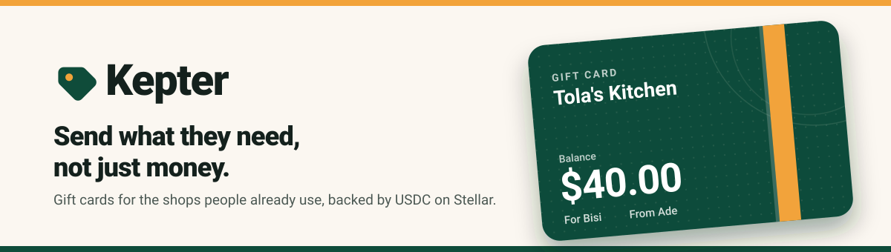
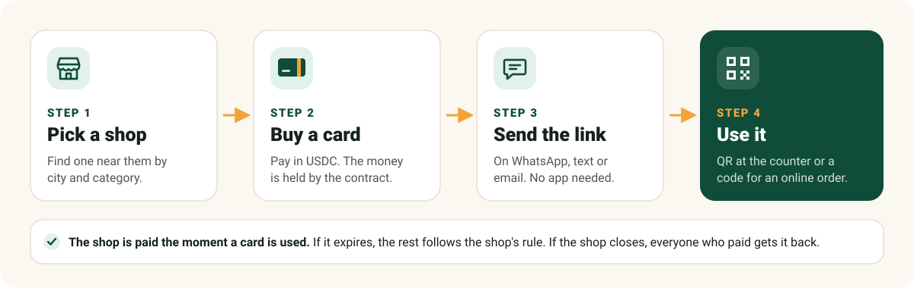
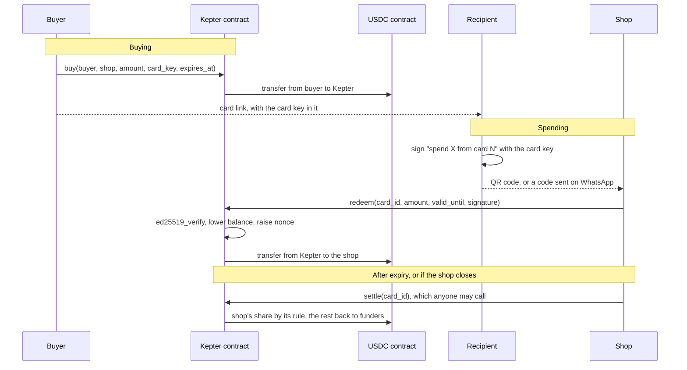

<p align="center">
  <a href="https://kepter.vercel.app">
    
  </a>
</p>

<p align="center">
  <a href="https://github.com/bluebridgehq/kepter/actions/workflows/contracts.yml"></a>&nbsp;
  <a href="https://github.com/bluebridgehq/kepter/actions/workflows/sdk.yml"></a>&nbsp;
  <a href="https://github.com/bluebridgehq/kepter/actions/workflows/frontend.yml"></a>&nbsp;
  <a href="https://kepter.vercel.app"></a>&nbsp;
  <a href="https://stellar.org"></a>&nbsp;
  <a href="LICENSE"></a>&nbsp;
  <a href="https://github.com/bluebridgehq/kepter/issues?q=is%3Aissue+is%3Aopen+label%3A%22good+first+issue%22"></a>
</p>

> **The idea is simple.** Ade lives in London. It is his sister Bisi's birthday in Lagos. Instead of sending money, he finds Tola's Kitchen near her on Kepter, buys a $40 gift card and sends her the link on WhatsApp. Bisi opens it, walks in, shows a QR code, and Tola is paid on the spot. If Tola had closed her shop, Ade would get his money back. **That's Kepter.**

<p align="center">
  <a href="https://kepter.vercel.app"><strong>Try the live demo</strong></a>
  &nbsp;·&nbsp;
  <a href="docs/OVERVIEW.md"><strong>Read the overview</strong></a>
  &nbsp;·&nbsp;
  <a href="https://github.com/bluebridgehq/kepter/issues?q=is%3Aissue+is%3Aopen+label%3A%22good+first+issue%22"><strong>Pick a good first issue</strong></a>
</p>

<br />

## Why Kepter?

When you send someone money, it is just money. Often what you want to give is something specific: groceries, medicine, school books, a birthday dinner. Gift cards do that, but today a gift card is only a promise. The shop keeps your money, and if it closes, the card is worth nothing. Small shops rarely sell gift cards at all, and never to someone in another country.

Kepter changes that. **The money for every card is held by a smart contract on Stellar, not by the shop.** The shop is paid the moment the card is used. If the card expires, what is left follows a rule the shop chose and the buyer saw before paying. If the shop closes, everyone who paid gets their share back. Anyone can check that every card is fully backed.

<table width="100%">
  <tr>
    <td width="50%">
      <strong>For families abroad</strong>
      <br/>
      Send groceries, medicine or school books from a shop in their hometown
    </td>
    <td width="50%">
      <strong>For friends and colleagues</strong>
      <br/>
      Buy a gift together: up to 20 people can chip in to one card
    </td>
  </tr>
  <tr>
    <td width="50%">
      <strong>For small shops</strong>
      <br/>
      Sell gift cards and store credit online, and get paid in dollars when they are used
    </td>
    <td width="50%">
      <strong>For companies and communities</strong>
      <br/>
      Rewards for staff, prizes, or support for people in need, at shops they choose
    </td>
  </tr>
</table>

<br />

## How it works

<p align="center">
  
</p>

The person who gets the gift needs **no wallet, no app and no account**. The link is the card.

<br />

## Try it

1. Open **[kepter.vercel.app](https://kepter.vercel.app)** and browse the shops. Everything runs on Stellar testnet, so no real money moves.
2. To buy a card, connect a Stellar wallet such as [Freighter](https://www.freighter.app) set to **Test Net**. If your wallet cannot hold USDC yet, the site adds it in one tap. Then get free test USDC from [Circle's faucet](https://faucet.circle.com).
3. Open the card link on your phone, tap **Pay at the counter**, and scan the code from the shop's **Scan** page on another device.

<br />

## What works today

Everything marked Live runs on Stellar testnet today.

| Feature | Status | Notes |
|:--------|:-------|:------|
| **Open a shop** | Live | Name, category, city and WhatsApp or website. Creates the shop's USDC trustline |
| **Find a shop** | Live | Search by name or city, filter by category |
| **Buy a gift card** | Live | From $1 to $1,000, valid 1, 3 or 6 months, with a message |
| **Chip in** | Live | Up to 20 people per card, from a separate link |
| **Pay at the counter** | Live | Signed QR code, works once, valid for 10 minutes |
| **Pay for an online order** | Live | The same signed code, sent to the shop on WhatsApp |
| **Unused balance rule** | Live | Buyer protected, Shared, or Shop keeps it |
| **Settle and refunds** | Live | Anyone can settle an expired card. Funders get their share back |
| **Proof of backing** | Live | What the contract owes always equals the USDC it holds |
| **Your gifts** | Live | Gifts bought on this device, with balances and settle buttons |
| **Store credit** | Live | Shops can top up a card for a customer |
| Gifts on any device | Planned | [#11](https://github.com/bluebridgehq/kepter/issues/11) |
| Money received tile | Planned | [#12](https://github.com/bluebridgehq/kepter/issues/12) |
| Local currency | Planned | [#15](https://github.com/bluebridgehq/kepter/issues/15) |
| Scanner key for staff | Planned | [#17](https://github.com/bluebridgehq/kepter/issues/17) |
| Move a card into a wallet | Planned | [#18](https://github.com/bluebridgehq/kepter/issues/18) |
| Bulk gift cards from a spreadsheet | Planned | [#20](https://github.com/bluebridgehq/kepter/issues/20) |
| Mainnet | Not yet | Needs an audit first |

<br />

## Deployed on testnet

| | |
|:--|:--|
| **Website** | [kepter.vercel.app](https://kepter.vercel.app) |
| **Contract** | [`CBOASWBXLWLNVMX65JGXITSO56WUHC6HXBFCVF2JTXVOYMIGY2LWNYU7`](https://stellar.expert/explorer/testnet/contract/CBOASWBXLWLNVMX65JGXITSO56WUHC6HXBFCVF2JTXVOYMIGY2LWNYU7) |
| **Asset** | Circle's testnet USDC, issuer `GBBD47IF6LWK7P7MDEVSCWR7DPUWV3NY3DTQEVFL4NAT4AQH3ZLLFLA5` |
| **Network** | Stellar testnet, Protocol 29 |
| **Tests** | 48 contract tests and 33 SDK tests (5 of them against testnet) |
| **Contract size** | About 24 KB of WASM |

Full details are in [`deployments/testnet.json`](deployments/testnet.json). This is testnet software and has not been audited.

<br />

## Getting started

```bash
git clone https://github.com/bluebridgehq/kepter.git
cd kepter

# Contract
rustup target add wasm32v1-none
cd contracts && cargo test && stellar contract build && cd ..

# SDK and website
pnpm install
pnpm --filter @kepter/sdk build
pnpm dev                     # → http://localhost:5173
```

`pnpm dev:phone` serves the site over HTTPS on your local network, so you can test the camera scanner on a phone. To deploy your own copy of the contract, see Deploying under Dive deeper.

<br />

## Roadmap

| Milestone | Status | Focus |
|:----------|:-------|:------|
| **M1** Foundation | Done | Contract, SDK and website live on testnet |
| **M2** Hardening | In progress | Auth and property tests, network limit checks, CI artifacts, event docs |
| **M3** Shop tools | Upcoming | Scanner key, money received, sales export, shop guide |
| **M4** Buyer tools | Upcoming | Gifts on any device, local currency, printable cards, bulk buying |
| **M5** Mainnet | Later | Audit, mainnet USDC, cash out to local money through an anchor |

See [all open issues](https://github.com/bluebridgehq/kepter/issues).

<br />

## Dive deeper

<details>
<summary><strong>Architecture</strong></summary>
<br/>

One Soroban contract holds the money and enforces every rule. The website talks to it through the TypeScript SDK and Stellar RPC. There is no backend.



**Why one contract with no admin?** Nobody, including us, can move the money except by following the rules. There is no upgrade and no pause.

**Why does each card have its own key?** The secret half sits in the card link after `#`, which never reaches a server. The recipient signs payments with it in the browser, so they need no wallet.

**Why no backend?** Every shop, card and balance is stored in the contract. The website reads it directly from Stellar RPC, so there is nothing to host but static files.

The full design, including the 84 byte payment message, settlement maths and storage layout, is in [docs/DESIGN.md](docs/DESIGN.md).

</details>

<details>
<summary><strong>What we use on Stellar</strong></summary>
<br/>

| Feature | How Kepter uses it |
|:--------|:-------------------|
| **Soroban contracts** | Hold card money and enforce buying, spending, expiry, settling and refunds |
| **USDC (Stellar Asset Contract)** | Every card is paid in Circle's USDC |
| **`trust` from CAP-73** | Opening a shop also creates the shop's USDC trustline in the same transaction |
| **`ed25519_verify`** | Checks the recipient's signed payment code before paying the shop |
| **`require_auth`** | Buyers approve payments, shops approve each charge |
| **Contract events** | Every shop and card change is emitted for history and alerts |
| **TTL extension** | Cards stay live for their whole life of up to 180 days |
| **Stellar RPC** | The website reads shops and cards directly, with no server |
| **Stellar Wallets Kit** | Freighter, LOBSTR, xBull, Albedo and more |

</details>

<details>
<summary><strong>Contract functions</strong></summary>
<br/>

| Function | Approved by | What it does |
|:---------|:------------|:-------------|
| `register_merchant(merchant, name, expiry_keep_bps, category, city, contact)` | Shop | Open a shop, list it and create its USDC trustline |
| `update_shop(merchant, name, category, city, contact)` | Shop | Change the shop's details |
| `set_expiry_rule(merchant, expiry_keep_bps)` | Shop | Change the unused balance rule for new cards |
| `close_store(merchant)` | Shop | Close for good. Open cards become refundable |
| `buy(buyer, merchant, amount, card_key, expires_at)` | Buyer | Create a card and return its ID |
| `top_up(funder, card_id, amount)` | Funder | Chip in, or add store credit |
| `redeem(card_id, amount, valid_until, signature)` | The card's shop | Spend from a card with a signed code |
| `settle(card_id)` | Anyone | Pay out an expired card, or a card from a closed shop |
| `claim_owed(card_id, account)` | Anyone | Send a saved payout to its owner |

Read only: `get_merchant`, `shop_count`, `get_shop`, `get_card`, `get_merchant_card`, `get_funder`, `get_owed`, `total_owed`, `usdc`. Errors and events are listed in [docs/DESIGN.md](docs/DESIGN.md).

</details>

<details>
<summary><strong>Glossary</strong></summary>
<br/>

| Word | Meaning |
|:-----|:--------|
| **Card** | Money held for one shop, with a balance and an expiry date |
| **Card link** | The link the recipient opens. Its secret part, after `#`, is what lets them spend the card |
| **Chip in link** | A separate link anyone can use to add money to a card. It never carries the secret |
| **Funder** | Anyone who paid into a card: the buyer, friends who chipped in, or a shop giving store credit |
| **Unused balance rule** | What happens to money left on an expired card: back to funders, shared, or kept by the shop |
| **Settle** | Paying out what is left on a card after it expires or its shop closes |
| **Owed** | A payout that could not be sent, saved for its owner to claim later |
| **Proof of backing** | The check that what the contract owes equals the USDC it holds |

</details>

<details>
<summary><strong>Project structure</strong></summary>
<br/>

```
kepter/
├── contracts/
│   ├── kepter/src/         # The Soroban contract (48 tests in test/)
│   └── scripts/            # deploy.sh
├── sdk/                    # @kepter/sdk: typed client, links, payment codes
├── frontend/               # The website: Vite, React 19, Tailwind v4
├── test-vectors/           # Fixtures shared by the contract and the SDK
├── deployments/            # Addresses of deployed contracts
├── docs/                   # OVERVIEW.md and DESIGN.md
└── .github/                # CI, issue forms, README images
```

Each part has its own README: [sdk/README.md](sdk/README.md) and [frontend/README.md](frontend/README.md).

</details>

<details>
<summary><strong>Prerequisites and tech stack</strong></summary>
<br/>

| Tool | Version | Install |
|:-----|:--------|:--------|
| **Rust** with `wasm32v1-none` | 1.91 or newer | [rustup.rs](https://rustup.rs), then `rustup target add wasm32v1-none` |
| **Stellar CLI** | 28 or newer | [Install guide](https://developers.stellar.org/docs/tools/cli) |
| **Node.js** | 24 or newer | [nodejs.org](https://nodejs.org) |
| **pnpm** | 10 | `corepack enable` |
| **Freighter** wallet | Latest | [freighter.app](https://www.freighter.app), set to Test Net |

| Layer | Technology |
|:------|:-----------|
| **Contract** | Rust and soroban-sdk 29 |
| **SDK** | TypeScript and @stellar/stellar-sdk 17 |
| **Website** | Vite, React 19, React Router 7, Tailwind CSS v4 |
| **Wallets** | Stellar Wallets Kit |
| **Hosting** | Vercel, static files only |
| **CI** | GitHub Actions for the contract, SDK and website |

</details>

<details>
<summary><strong>Deploying</strong></summary>
<br/>

```bash
stellar keys generate kepter-deployer --network testnet --fund
contracts/scripts/deploy.sh
```

The script builds the contract, deploys it against Circle's testnet USDC and writes the result to `deployments/testnet.json`. Set `ASSET=CODE:ISSUER` to use another asset. To point the website at your copy, see [frontend/README.md](frontend/README.md).

</details>

<br />

## Contributing

We would love your help. Here is how to jump in:

1. Browse the [good first issues](https://github.com/bluebridgehq/kepter/issues?q=is%3Aissue+is%3Aopen+label%3A%22good+first+issue%22), or filter by area: [contracts](https://github.com/bluebridgehq/kepter/labels/contracts), [sdk](https://github.com/bluebridgehq/kepter/labels/sdk), [frontend](https://github.com/bluebridgehq/kepter/labels/frontend)
2. Read [CONTRIBUTING.md](CONTRIBUTING.md) for setup and the checks to run
3. Comment on an issue to ask for it, wait to be assigned, then open a pull request with `Closes #<number>`

Questions go to [SUPPORT.md](SUPPORT.md), and security reports to [SECURITY.md](SECURITY.md), never to a public issue.

<br />

<h3 align="center">Contributors</h3>

<p align="center">
  <a href="https://github.com/bluebridgehq/kepter/graphs/contributors">
    
  </a>
</p>

<br />

---

<p align="center">
  <sub><strong>Send what they need, not just money.</strong> Built by <a href="https://github.com/bluebridgehq">Blue Bridge</a>. Licensed under <a href="LICENSE">Apache 2.0</a>.</sub>
</p>
